# Ex-03EDA

## AIM
To perform EDA on the given data set. 

# Explanation
The primary aim with exploratory analysis is to examine the data for distribution, outliers and 
anomalies to direct specific testing of your hypothesis.
 

# ALGORITHM
### STEP 1:

Import the required packages(pandas,numpy,seaborn).

### STEP 2:

Read the given .csv file.
### STEP 3:

Convert the file into a dataframe and get information of the data.

### STEP 4:

Remove the non numerical data columns using drop() method.

### STEP 5:

Replace the null values using (.fillna).

### STEP 6:

Returns object containing counts of unique values using (value_counts()).

### STEP 7:

Plot the counts in the form of Histogram or Bar Graph.

### STEP 8:

Find the pairwise correlation of all columns in the dataframe(.corr()).

### STEP 9:

Save the final data set into the file.

# CODE :

~~~

#Program developed by : SOUVIK KUNDU
#Register number : 212221230105

import pandas as pd
import numpy as np
import seaborn as sns
df=pd.read_csv("titanic_dataset.csv")
df.info()
df.head()
df.tail()
df.isnull().sum()
df.drop("Cabin",axis=1,inplace=True)
df.info()
df.isnull().sum()
df["Age"]=df["Age"].fillna(df["Age"].median())
df.boxplot()
df.isnull().sum()
df["Embarked"]=df["Embarked"].fillna(df["Embarked"].mode()[0])
df.isnull().sum()
df["Embarked"].value_counts()
df["Pclass"].value_counts()
df["Survived"].value_counts()
sns.countplot(x="Survived",data=df)
sns.countplot(x="Pclass",data=df)
sns.countplot(x="Sex",data=df)
df.info()
sns.displot(df["Fare"])
sns.countplot(x="Pclass",hue="Survived",data=df)
sns.displot(df[df["Survived"]==0]["Age"])
pd.crosstab(df["Pclass"],df["Survived"])
pd.crosstab(df["Sex"],df["Survived"])
df.corr()
sns.heatmap(df.corr(),annot=True)

~~~

# OUPUT:

READ DATA:

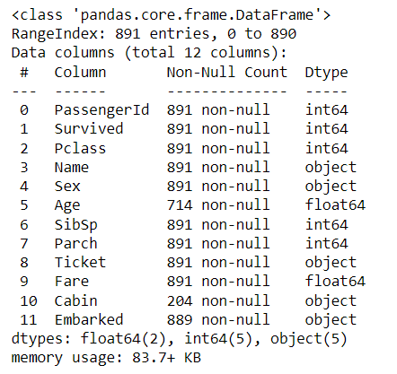
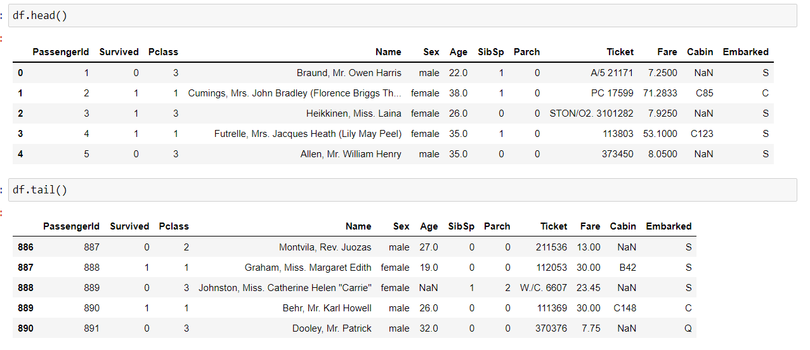

CHECKING NULL VALUES AND REMOVING CABIN COLUMN(OUTLIERS) :

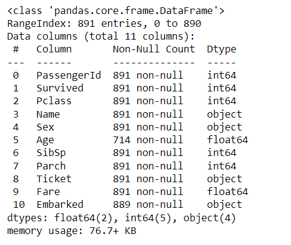
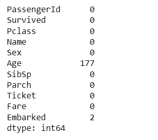

APPLYING DATA CLEANING PROCESS TO COLUMN AGE AND EMBARKED :

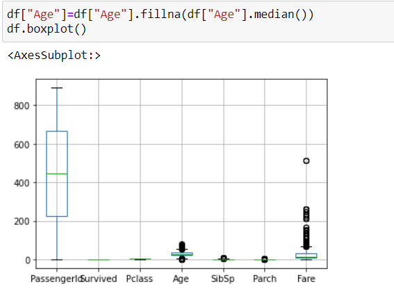
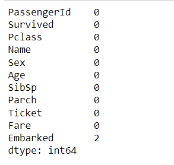
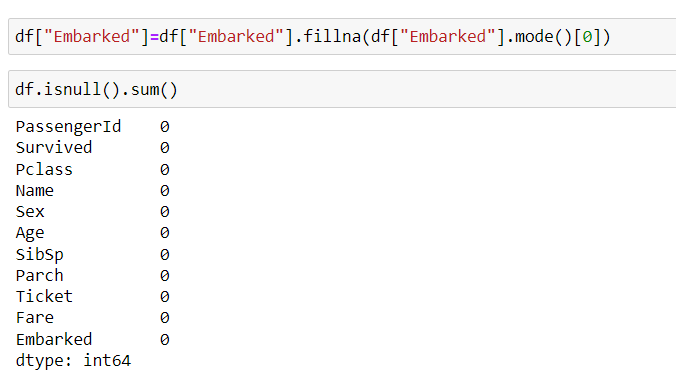

VALUE_COUNTS :

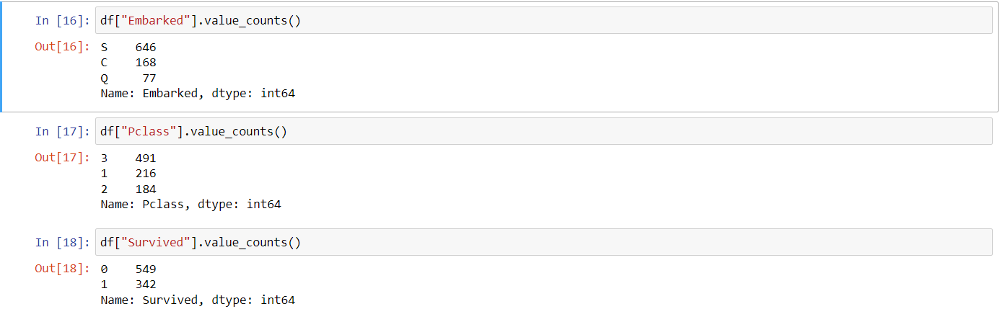

GRAPH PLOTS :

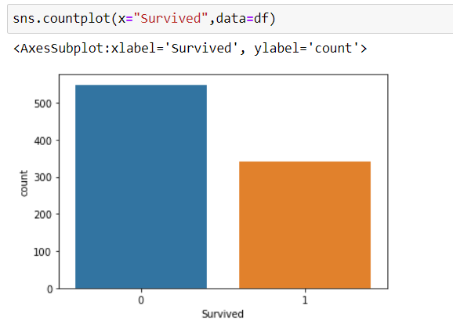
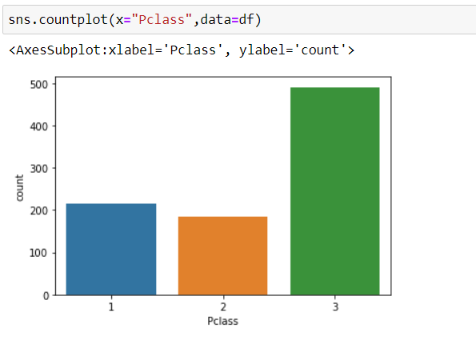
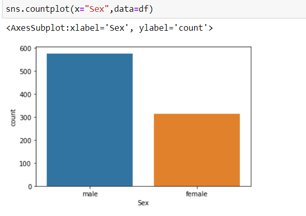

AFTER REMOVING NULL VALUES :

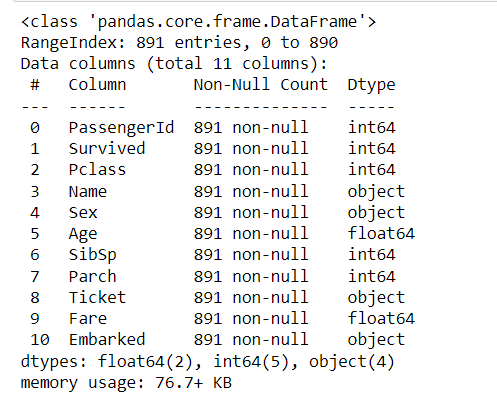
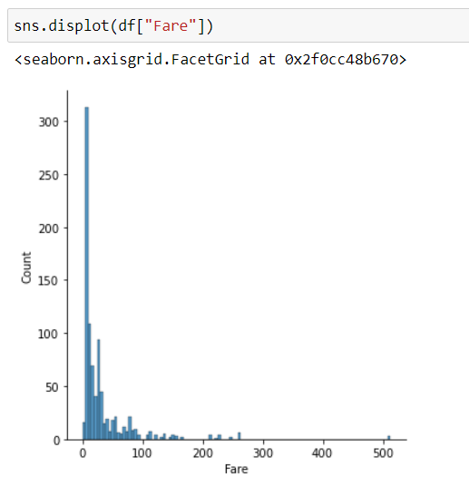
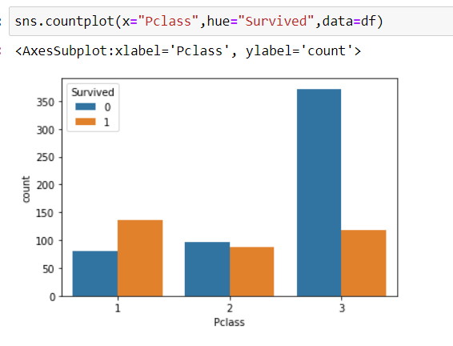
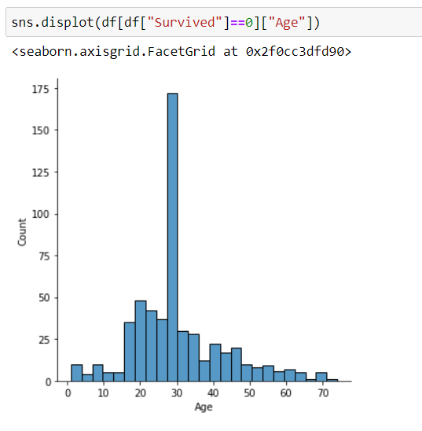
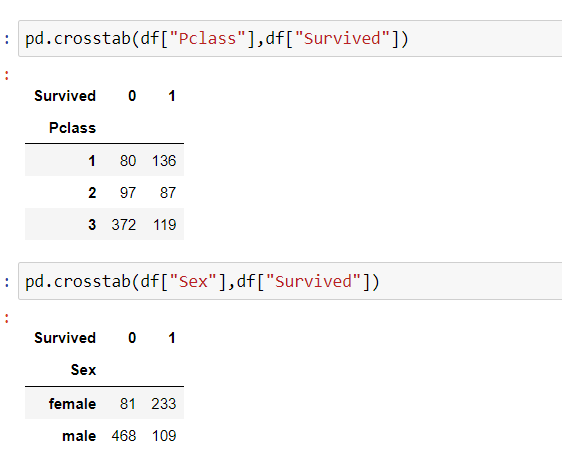

CORRELATION BETWEEN DATA'S:

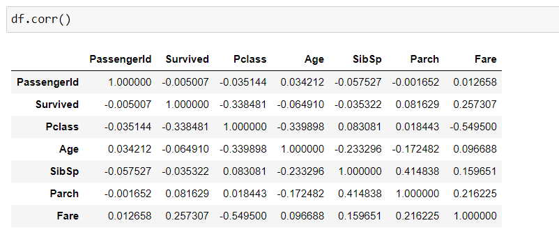

HEATMAP:
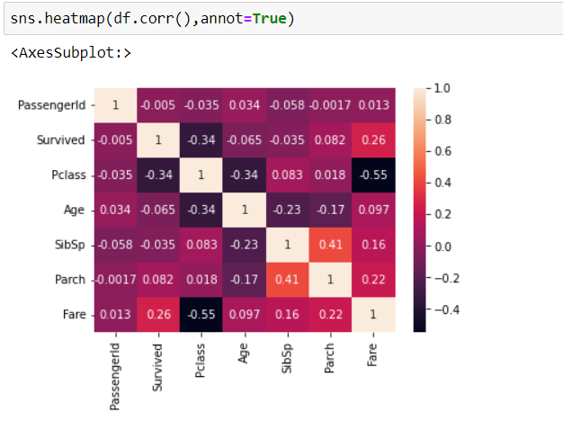

### RESULT :

Thus the Exploratory Data Analysis (EDA) on the given data set is successfully completed.
